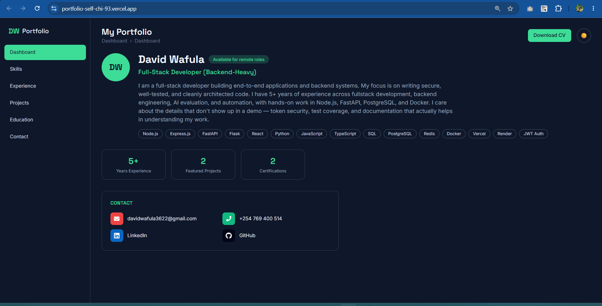

# David Wafula — Portfolio

Personal portfolio site built with React, Vite, and Tailwind CSS. Live at [portfolio-self-chi-93.vercel.app](https://portfolio-self-chi-93.vercel.app).

## Features

- Dashboard-style layout with sidebar navigation and mobile drawer
- Light/dark theme toggle (persisted via localStorage)
- Sections: Dashboard, Skills, Experience, Projects, Education, Contact
- Contact form wired to EmailJS for real message delivery
- Resume download
- Featured projects: [Auth Microservice](https://github.com/davidtiger3622/auth-microservice) and [Personal Finance Tracker](https://github.com/davidtiger3622/finance-tracker)

## Tech Stack

React 19, Vite, Tailwind CSS, React Icons, EmailJS

## Deployment

Deployed on Vercel, with EmailJS environment variables configured in the Vercel project settings for the contact form.

## License

MIT — see [LICENSE](./LICENSE).
